# AnserFlow — 系统架构概述

> 本文档从 `05-other.md` 拆分而来，汇集系统愿景、技术栈选型与当前约束范围。

## 一、系统愿景

构建一个 **AI Agent + 自然人混合协作** 的项目管理平台。核心场景：

> 自然人创建项目 → 拉群（CEO/CTO/前端/后端等 Agent 角色入群）→ 发布需求 → Agent 根据角色设定自动讨论生成落地方案 → 自动拆解为 Issue 并关联项目 → Agent 认领执行 → 自然人审核验收。

---

## 当前阶段闭环约束

为避免规划项长期悬空，本文档对当前阶段范围做如下收口：

1. 当前交付只以 **L1-L4 路线图**（见 [10-roadmap.md](10-roadmap.md)）为验收范围；远期规划统一归入 [11-backlog.md](11-backlog.md)，不计入本轮完成标准。
2. 当前 Git 平台只验收 **GitHub**；`git_platform` 仅保留数据模型兼容位，不要求本轮实现 Gitea / GitLab。
3. 当前前端交付闭环 **admin SPA 嵌入 Go** 与 **客户端 Web SPA（IM 聊天界面）**；统一使用 Next.js SPA 技术栈，浏览器访问。
4. 当前客户端闭环 **Web 端**；Crowdin / Lokalise、Pact 合约测试、`golang-migrate`、文档自动生成与 wiki 拆分均归入 Phase 2。
5. 文中的目录树、接口、伪代码和工作流若未在仓库中落地，默认按 **目标架构说明** 理解。

---

## 目标架构与参考骨架差异清单

当前仓库中的参考代码位于：

`reference/workflow-backend-skeleton/`

该目录的定位是：

- 用于沉淀当前已经讨论过的工作流后端骨架
- 用于给后续正式实现提供可读的包边界和最小调用链参考
- 不直接代表本文目标架构已经落地

### 建议保留的模块

- `internal/model/` — 实体拆分方向与当前工作流设计一致
- `internal/convert/` — JSON 字段编解码可复用思路
- `internal/store/interfaces.go` — 接口边界可保留
- `internal/store/gormstore/` — Find/List/Create/Update 风格可延续
- `internal/app/discussion/` — 讨论态抽取合理
- `internal/app/planning/` — 业务主链 `DiscussionState → PlanSpec → PlanTask → Issue` 可保留
- `internal/app/execution/` — Issue/IssueSpec/AutomationAttempt 分开处理方向一致

### 建议废弃或不要直接沿用的部分

- `internal/bootstrap/` — 手工装配骨架，未接入完整配置/日志/权限/优雅关闭
- `internal/domain/*` — 仅用于占位
- `transport/http` 中的简化错误处理 — 与国际化错误码体系不一致
- `go.mod` — 模块名与依赖版本只是参考占位

### 建议做映射迁移的模块

- `internal/app/execution/` → `internal/agent/` + `internal/status/` + `internal/worker/` + `internal/runtime/`
- `internal/transport/http/` → 正式 handler/router/middleware
- `internal/store/gormstore/` → 需补索引策略、分页、批处理、事务事件、审计字段

### 当前最关键的未覆盖模块

- `internal/agent/` — Agent 编排
- `internal/runtime/` — 运行时管理
- `internal/sandbox/` — Docker 沙箱
- `internal/git/` — Git 管理
- `internal/status/` — 状态机
- `internal/notification/` — 通知
- `internal/token/` — Token 配额
- `internal/ws/` — WebSocket
- `internal/scheduler/` — 调度器
- `internal/worker/` — Worker
- `internal/middleware/` — 中间件

### 结论

- 工作流实体与状态机设计，可参考 `reference/workflow-backend-skeleton/` 中的 model、app、store
- Agent、Runtime、Sandbox、Worker、WebSocket、权限与中间件体系，以目标架构章节为准重新落地

---

## 二、技术栈总览

```
┌──────────────────────────────────────────┐
│ 前端       Next.js 14 SPA (static export)│
│           shadcn/ui + Tailwind CSS        │
│           TanStack Query (数据请求)       │
│           Zustand (客户端状态)            │
│           React Hook Form + Zod (表单)    │
│           next-intl (国际化)              │
├──────────────────────────────────────────┤
│ 后端框架   Gin                           │
│ ORM        GORM                          │
│ 数据库     MySQL 8.0+                    │
│ CLI        Cobra                         │
│ 静态嵌入   embed (Go 1.16+)              │
│ 配置       Viper                         │
│ 日志       Zap                           │
│ 校验       go-playground/validator       │
│ 权限       Casbin (RBAC)                 │
├──────────────────────────────────────────┤
│ 缓存/广播  Redis                         │
│ 实时通信   Gorilla WebSocket             │
│           + Redis Pub/Sub (分布式)        │
│ 任务队列   Asynq (基于 Redis)            │
├──────────────────────────────────────────┤
│ AI Agent   Eino (字节跳动 CloudWeGo)     │
│            + 自研业务封装层               │
│ 沙箱       Docker SDK for Go            │
├──────────────────────────────────────────┤
│ Skills     手动编写 + ZIP 导入           │
│ 认证       JWT + OAuth2 (GitHub)         │
│ 邮件       gomail (SMTP)                 │
│ 邀请       分享链接 + 邮箱               │
│ 国际化     next-intl (前端)               │
│           go-i18n (后端)                  │
│ API文档    Swagger (swaggo/swag)         │
│ 跨域       gin-contrib/cors              │
└──────────────────────────────────────────┘
```

> **opencode**：AnserFlow 内置默认运行时，基于开源 AI 编码代理 [anomalyco/opencode](https://github.com/anomalyco/opencode)（TypeScript，160k+ Stars）。**hermes**：Nous Research 开源 AI Agent，支持 20+ Provider、持久记忆、Skills 系统。

### 选型理由

| 技术 | 理由 |
|------|------|
| **Gin** | 高性能、生态成熟、中文社区活跃 |
| **GORM** | Go 最流行的 ORM，支持 MySQL 全面 |
| **MySQL 8.0+** | 关系型数据、事务支持、稳定可靠 |
| **Cobra** | Go CLI 标准库 |
| **embed** | Go 1.16+ 原生静态文件嵌入 |
| **Viper** | Go 配置管理标准库，支持 YAML/ENV 多源加载 |
| **Zap** | Uber 开源高性能结构化日志库 |
| **Casbin** | 灵活的 RBAC/ABAC 权限模型 |
| **Next.js SPA** | `output: "export"` 模式，产物可直接嵌入 Go 二进制 |
| **Redis** | 缓存 + WebSocket 分布式 Pub/Sub + Asynq 任务队列，一个组件覆盖三个场景 |
| **Gorilla WebSocket** | Go 社区最成熟的 WebSocket 库 |
| **Asynq** | Go 原生、基于 Redis、支持重试/超时/优先级/死信队列 |
| **Eino** | 字节跳动开源、Graph/Workflow 多 Agent 编排、流式原生支持 |
| **Docker SDK** | Agent 编码沙箱隔离，资源限制、自动清理 |

### 系统功能模块总览

```mermaid
graph TD
    A["AnserFlow 平台"] --> B["用户与权限"]
    A --> C["Agent 管理"]
    A --> D["群聊协作"]
    A --> E["项目管理"]
    A --> F["Issue 系统"]
    A --> G["Agent 执行引擎"]
    A --> H["Skills 技能系统"]
    A --> R["运行时管理"]

    B --> B1["注册/登录(OAuth/GitHub)"]
    B --> B2["组织/团队管理"]
    B --> B3["角色权限(RBAC)"]
    B --> B4["邀请机制"]

    C --> C1["Agent 角色定义(自定义提示词)"]
    C --> C2["Agent System Prompt / 人设"]
    C --> C3["绑定运行时（opencode 默认）"]
    C --> C4["Agent 绑定运行时 + 配置覆盖"]
    C --> C5["全局开关 / 单独启停"]

    D --> D1["创建群组"]
    D --> D2["拉入 Agent + 自然人"]
    D --> D3["需求讨论(Agent自动参与)"]
    D --> D4["方案产出 → 自动建 Issue"]
    D --> D5["@Agent 任务布置(Agent间协作)"]
    D --> D6["/new 会话上下文切换"]

    E --> E1["创建项目"]
    E --> E2["关联 GitHub 仓库(HTTP/SSH)"]
    E --> E3["项目设置/成员"]

    F --> F1["Issue CRUD"]
    F --> F2["状态: Backlog→Todo→InProgress→InReview→Done"]
    F --> F3["优先级(P0-P4)"]
    F --> F4["子 Issue 层级"]
    F --> F5["分配给 Agent 或 自然人"]

    G --> G1["监听 todo→in_progress 自动入队"]
    G --> G2["Asynq 入队 → Worker 消费"]
    G --> G3["Docker 沙箱 + opencode run"]
    G --> G4["opencode 检查结果 → commit → PR"]
    G --> G5["监听人工提示词 → 重新执行"]

    H --> H1["Skill 定义(全局)"]
    H --> H2["Skill 绑定到 Agent"]
    H --> H3["Skill 启用/禁用(全局+单Agent)"]
    H --> H4["手动编写 + ZIP 导入"]
```



---

## 参考代码映射

> 当前仓库中的 Go 代码骨架已被单独归档为参考实现。

| 路径 | 说明 |
|------|------|
| `reference/workflow-backend-skeleton/` | 参考模块根 |
| `reference/workflow-backend-skeleton/cmd/server/main.go` | 参考启动入口 |
| `reference/workflow-backend-skeleton/internal/` | 参考业务代码 |
| `reference/workflow-backend-skeleton/internal/app/` | 工作流应用层 |
| `reference/workflow-backend-skeleton/internal/store/` | 持久化层 |
| `reference/workflow-backend-skeleton/internal/model/` | 数据模型 |

> 说明：
> - 本文中的目录树描述的是目标仓库结构。
> - 当前参考代码只是一版可阅读、可继续拆分的骨架，不应视为最终正式目录已定稿。

---

> 📌 本文档由 `05-other.md` 拆分而来 (2026-05-20)
