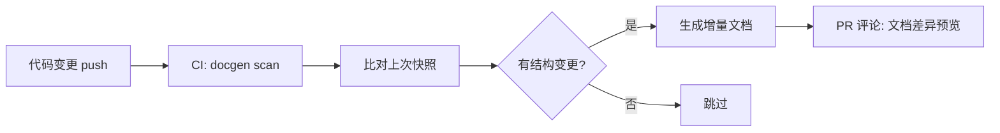
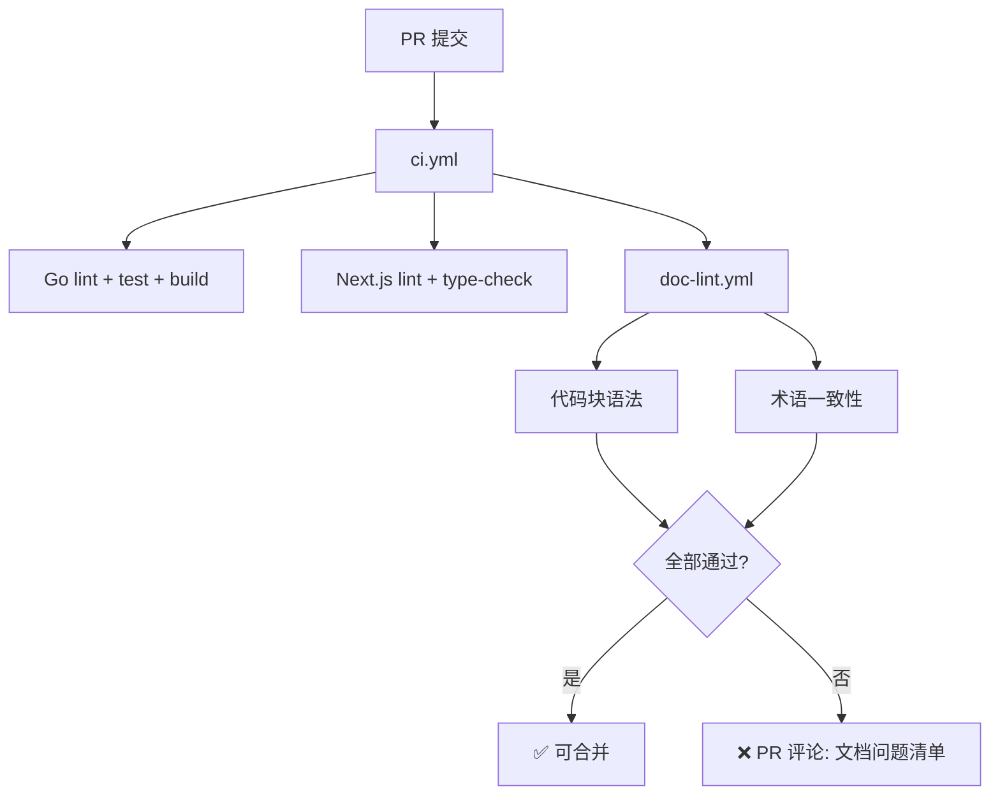
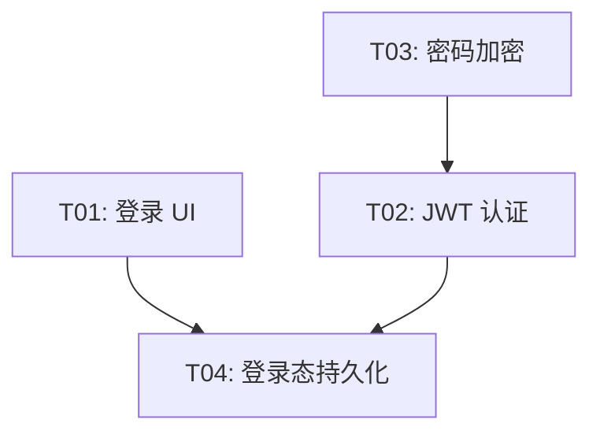

# AnserFlow — 远期 Backlog（Phase 2+）

> 以下为 AnserFlow 平台远期能力规划，**不纳入当前 L1-L4 验收**。若要启动，需单独建任务并补验收标准。

## 文档生成

当前项目文档依赖手工编写。以下补全**代码 → 文档**的反向生成能力。

### 代码 → 文档自动生成

| 源 | 产物 | 触发时机 |
|------|------|----------|
| GORM Model 结构体 | 数据字典 Markdown（字段/类型/约束/索引） | CI push main |
| Gin Handler + swag 注解 | OpenAPI 文档增强（含请求示例/错误码） | CI push main |
| TypeScript interface/type | API 契约文档 | CI push main |
| SQL Migration 文件 | 表结构变更日志 + 回滚说明 | `anserflow migrate` |
| Git commit log | CHANGELOG.md（按 Conventional Commits 分组） | CI tag `v*` |

```go
// internal/docgen/engine.go — 文档生成引擎
type DocGenerator interface {
    ScanSource(dir string) ([]SourceUnit, error)
    Generate(units []SourceUnit) (*Document, error)
    Diff(prev, current *Document) (*Changelog, error)
}
```



### 文档质量门禁

```yaml
文档 CI 检查项:
  代码块语法校验:   ```go → go build   ```ts → tsc   ```sql → 语法解析
  Mermaid 语法:    mermaid-cli 渲染测试
  术语一致性:       关键词表校验（Issue / Agent / Skill 不混用别名）
  新鲜度评分:       对比关联代码变更频率，标记可能过时的文档章节
```



## 任务计划

当前任务计划按 L1-L4 静态拆分。以下扩展仅作为下一阶段增强方向，不与当前交付混算。

### Agent 驱动的智能拆分

利用 anserAgent 对需求做语义级拆解，自动推断子任务、优先级和依赖关系：

```
需求: "做一个用户登录页"
        │
        ▼
  anserAgent 拆分（分析需求语义）
        │
        ▼
  ┌─────────────────────────────────────────┐
  │ T01  登录表单 UI        前端  2h  p1     │
  │ T02  JWT 认证 API       后端  3h  p0     │
  │ T03  bcrypt 密码加密    后端  1h  p0  ←── T02 依赖 T03
  │ T04  登录态持久化       前端  1h  p1  ←── T04 依赖 T01+T02
  └─────────────────────────────────────────┘
```

```go
// internal/agent/backlog_breakdown.go
type BreakdownResult struct {
    Tasks []BreakdownTask `json:"tasks"`
}
type BreakdownTask struct {
    Title          string   `json:"title"`
    Description    string   `json:"description"`
    EstimatedHours float64  `json:"estimated_hours"`
    RoleLabel      string   `json:"role_label"`
    Priority       string   `json:"priority"`
    DependsOn      []int    `json:"depends_on"`
    Acceptance     string   `json:"acceptance"`
}
```

### 任务依赖图可视化

- **循环依赖检测**：自动告警并阻断
- **关键路径高亮**：决定总工期的最长依赖链
- **并行度分析**：最大可并行执行的任务数
- **看板联动**：拖动任务卡片自动更新依赖线



### Issue 层级任务视图

Todo 不再作为独立实体；任务视图直接读取 `issues` 表：

| 视图概念 | Issue 表达 | 说明 |
|----------|------------|------|
| 需求 | `status=backlog` 且 `parent_id IS NULL` | 承载原始需求与讨论上下文 |
| 任务列表 | `status=todo` 且 `parent_id=<backlog_id>` | 同一 backlog 下的任务放在一起 |
| 执行中 | `status=in_progress` | 正在运行的任务 Issue |
| 审核中 | `status=in_review` | 唯一人工确认节点，此时展示 PR |
| 已完成 | `status=done` | PR 已完成并合并 |

### 执行策略引擎

| 策略 | 行为 | 适用场景 |
|------|------|----------|
| 顺序执行 | 按排列逐个执行 | 简单线性任务 |
| 依赖优先 | 拓扑排序，先完成前置任务 | 有明确依赖链 |
| 角色匹配 | 按 Agent role_label 认领 | 多人协作 |
| 并行批处理 | 无依赖任务并行，最多 N 并发 | 提速 |
| 风险优先 | p0 → p4 降序执行 | 核心路径先行 |
| 时间盒 | 单任务超时自动标记 blocked | 防卡死 |

### 多维度任务视图

```
视图模式:
├── 列表视图    L1-L4 层级排列
├── 看板视图    backlog(需求) → todo(任务) → in_progress → in_review → done 泳道
├── 时间线      甘特图展示起止时间和依赖
├── 人员视图    按 Agent/自然人分组
└── 阻塞视图    仅展示阻塞链上的任务
```

---

## 工程基础设施（Phase 2）

以下项目在 L1-L4 中已评估，归入 Phase 2 独立立项：

### Pact 合约测试

前后端 API 契约一致性校验，当前用 TypeScript interface + Go struct 手工对齐。

| 项目 | 说明 |
|------|------|
| 触发时机 | 前后端 API 变更时 CI 自动运行 |
| 参考方案 | Pact Broker + `@pact-foundation/pact` (JS) + `pact-go` |

### golang-migrate 迁移工具

当前 L1-L4 采用 `AutoMigrate + 备份 SQL + 种子数据`。Phase 2 切换为 `golang-migrate/migrate` 以支持版本化迁移和回滚。

### Crowdin / Lokalise 翻译管理

当前 L1-L4 手动编辑 JSON/TOML 翻译文件 + `goi18n merge`。如翻译量明显增加，Phase 2 接入 Crowdin 或 Lokalise 实现翻译协作和 CI 自动同步。

### RTK 命令输出压缩

> 参考 [yolobox](https://github.com/finbarr/yolobox) 的 RTK（command-output compression proxy）设计思路。

#### 问题

anserAgent 执行过程中通过 stdout 输出大量命令结果（测试日志、构建输出、lint 报告、文件搜索等），当前方案全量写入 `agent_logs` 并通过 WebSocket 推送给前端。体积大、信息密度低，带来三重开销：

| 开销类型 | 影响 | 典型场景 |
|---------|------|---------|
| **存储开销** | MySQL `agent_logs` 表快速增长 | 一次完整 Issue 执行可能产生数千条日志 |
| **传输开销** | WebSocket 推送大量冗余数据 | 前端渲染 500 行测试输出，实际关键行只有 5 行 |
| **Token 开销** | 命令输出回传 LLM 消耗 Token | `npm test` 输出 2000 行，LLM 只需看 "3 failed" 摘要 |

#### 方案

在 Worker 的 stdout 处理流水线中插入 **压缩适配器（OutputCompressor）**，对命令输出做智能摘要后存储/推送/注入：

```
anserAgent stdout
    │
    ▼
┌─────────────────────┐
│ OutputCompressor    │  ← 新增：智能压缩层
│ ├── 错误行识别       │     保留 stderr / FAIL / ERROR 行完整内容
│ ├── 关键行保留       │     保留首行、末行、总结行（如 "Tests: 3 failed, 7 passed"）
│ ├── 中间行抽样       │     每 N 行保留 1 行（可配置）
│ └── 摘要生成         │     生成 "[压缩] 原始 2000 行 → 摘要 30 行" 标记
└──────┬──────────────┘
       │
       ├──→ agent_logs（压缩版）
       ├──→ WebSocket（压缩版）
       └──→ LLM 上下文（极度压缩版）
```

**压缩策略**（分三种场景）：

| 场景 | 策略 | 保留内容 | Token 节省（估算） |
|------|------|---------|-------------------|
| **存储** (`agent_logs`) | 智能摘要 | 错误行 100% + 关键行 + 每 N 行抽样 | ~60-80% |
| **传输** (WebSocket) | 折叠截断 | 错误行 100% + 前端可展开折叠 | ~70-90% |
| **上下文** (LLM) | 极度压缩 | 仅错误行 + 总结行 + 统计摘要 | ~90-95% |

**接口设计**：

```go
// internal/worker/compressor.go

type CompressionLevel int

const (
    CompressStorage   CompressionLevel = iota  // 存储级：智能摘要
    CompressTransport                          // 传输级：折叠截断
    CompressContext                            // 上下文级：极度压缩
)

type OutputCompressor interface {
    // Compress 压缩单行 stdout 输出
    // 返回 nil 表示该行被完全丢弃
    // 返回 CompressedLine 表示压缩结果
    Compress(line string, level CompressionLevel) *CompressedLine
    
    // Summary 生成压缩统计摘要
    Summary() CompressionSummary
}

type CompressedLine struct {
    Text      string `json:"text"`                // 压缩后文本
    Original  string `json:"original,omitempty"`  // 原始文本（仅关键行保留）
    Truncated bool   `json:"truncated"`           // 是否被截断
    KeepFull  bool   `json:"keep_full"`           // 是否保留完整原始内容
}

type CompressionSummary struct {
    OriginalLines int     `json:"original_lines"`
    KeptLines     int     `json:"kept_lines"`
    Ratio         float64 `json:"ratio"`
}
```

**配置文件**：

```yaml
# config.yaml
output_compression:
  enabled: true                # 是否启用（Phase 2 默认开启）
  storage:
    sample_rate: 5             # 每 N 行保留 1 行
    max_lines: 200             # 单次执行最多保留行数
  transport:
    fold_threshold: 500        # 超过此行数触发前端折叠
    error_only: false          # true=仅推送错误行
  context:
    max_lines: 20              # LLM 上下文最大行数
    error_only: true           # 上下文仅注入错误行
    include_summary: true      # 注入统计摘要
```

#### 实施路径

1. **Phase 2-1**：实现 `OutputCompressor` 核心逻辑 + MySQL 存储级压缩
2. **Phase 2-2**：WebSocket 推送接入传输级压缩，前端适配展开/折叠
3. **Phase 2-3**：LLM 上下文注入接入压缩，与 `OutputParser` 协同工作

---

## 可参考项目

| 项目 | 参考点 |
|------|--------|
| Plane (plane.so) | Issue 看板、状态流转的 UI/UX |
| OpenHands / Devon | Agent 自动编码的沙箱架构 |
| Mattermost | 群聊 + WebSocket 架构 |
| Dify | Agent 工作流编排的交互设计 |
| Eino (cloudwego/eino) | Go Agent 框架的 Graph/Workflow 模式 |
| Asynq (hibiken/asynq) | Go 任务队列的 API 设计 |


