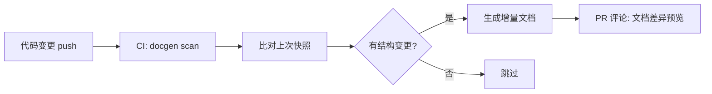
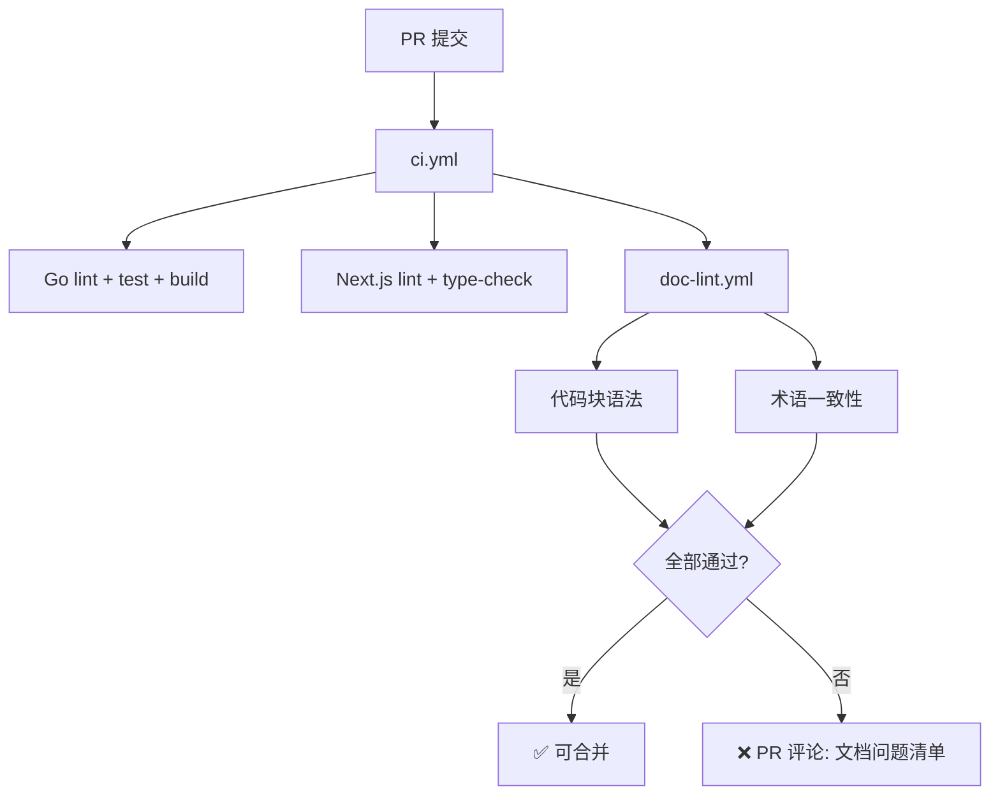
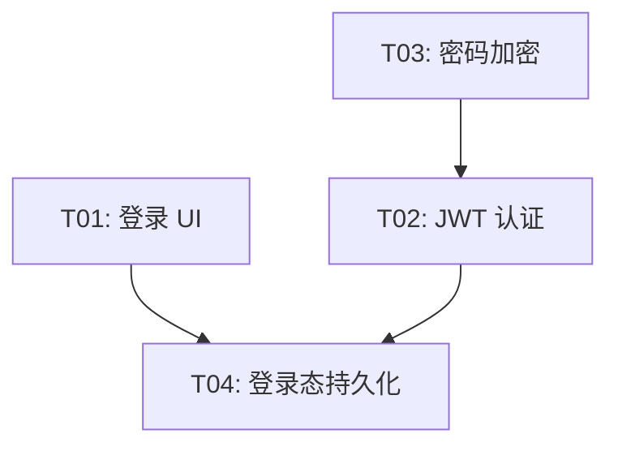

# AnserFlow — 远期 Backlog（Phase 2+）

> 本文档从 `05-other.md` 第十五章拆分而来。以下为 AnserFlow 平台远期能力规划，**不纳入当前 L1-L4 验收**。若要启动，需单独建任务并补验收标准。

## 文档生成

当前项目文档依赖手工编写。以下补全**代码 → 文档**的反向生成能力。

### 代码 → 文档自动生成

| 源 | 产物 | 触发时机 |
|------|------|----------|
| GORM Model 结构体 | 数据字典 Markdown（字段/类型/约束/索引） | CI push main |
| Gin Handler + swag 注解 | OpenAPI 文档增强（含请求示例/错误码） | CI push main |
| TypeScript interface/type | API 契约文档 | CI push main |
| SQL Migration 文件 | 表结构变更日志 + 回滚说明 | `anserflow migrate` |
| Git commit log | CHANGELOG.md（按 Conventional Commits 分组） | CI tag `v*` |

```go
// internal/docgen/engine.go — 文档生成引擎
type DocGenerator interface {
    ScanSource(dir string) ([]SourceUnit, error)
    Generate(units []SourceUnit) (*Document, error)
    Diff(prev, current *Document) (*Changelog, error)
}
```



### 文档质量门禁

```yaml
文档 CI 检查项:
  代码块语法校验:   ```go → go build   ```ts → tsc   ```sql → 语法解析
  Mermaid 语法:    mermaid-cli 渲染测试
  术语一致性:       关键词表校验（Issue / Agent / Skill 不混用别名）
  新鲜度评分:       对比关联代码变更频率，标记可能过时的文档章节
```



## 任务计划

当前任务计划按 L1-L4 静态拆分。以下扩展仅作为下一阶段增强方向，不与当前交付混算。

### Agent 驱动的智能拆分

利用 anserAgent 对需求做语义级拆解，自动推断子任务、优先级和依赖关系：

```
需求: "做一个用户登录页"
        │
        ▼
  anserAgent 拆分（分析需求语义）
        │
        ▼
  ┌─────────────────────────────────────────┐
  │ T01  登录表单 UI        前端  2h  p1     │
  │ T02  JWT 认证 API       后端  3h  p0     │
  │ T03  bcrypt 密码加密    后端  1h  p0  ←── T02 依赖 T03
  │ T04  登录态持久化       前端  1h  p1  ←── T04 依赖 T01+T02
  └─────────────────────────────────────────┘
```

```go
// internal/agent/backlog_breakdown.go
type BreakdownResult struct {
    Tasks []BreakdownTask `json:"tasks"`
}
type BreakdownTask struct {
    Title          string   `json:"title"`
    Description    string   `json:"description"`
    EstimatedHours float64  `json:"estimated_hours"`
    RoleLabel      string   `json:"role_label"`
    Priority       string   `json:"priority"`
    DependsOn      []int    `json:"depends_on"`
    Acceptance     string   `json:"acceptance"`
}
```

### 任务依赖图可视化

- **循环依赖检测**：自动告警并阻断
- **关键路径高亮**：决定总工期的最长依赖链
- **并行度分析**：最大可并行执行的任务数
- **看板联动**：拖动任务卡片自动更新依赖线



### Todo ↔ Issue 双向同步

| Todo 状态 | Issue 状态 | 同步方向 |
|-----------|-----------|----------|
| `[ ]` 未开始 | `backlog` | 创建时 Todo → Issue |
| 执行中 | `in_progress` | Issue → Todo（自动标记） |
| `[x]` 已完成 | `done` | 双向（任一侧完成即同步） |
| 验收退回 | `in_review` | Issue → Todo（取消勾选） |

### 执行策略引擎

| 策略 | 行为 | 适用场景 |
|------|------|----------|
| 顺序执行 | 按排列逐个执行 | 简单线性任务 |
| 依赖优先 | 拓扑排序，先完成前置任务 | 有明确依赖链 |
| 角色匹配 | 按 Agent role_label 认领 | 多人协作 |
| 并行批处理 | 无依赖任务并行，最多 N 并发 | 提速 |
| 风险优先 | p0 → p4 降序执行 | 核心路径先行 |
| 时间盒 | 单任务超时自动标记 blocked | 防卡死 |

### 多维度任务视图

```
视图模式:
├── 列表视图    L1-L4 层级排列
├── 看板视图    backlog → todo → in_progress → done 泳道
├── 时间线      甘特图展示起止时间和依赖
├── 人员视图    按 Agent/自然人分组
└── 阻塞视图    仅展示阻塞链上的任务
```

---

## 可参考项目

| 项目 | 参考点 |
|------|--------|
| Plane (plane.so) | Issue 看板、状态流转的 UI/UX |
| OpenHands / Devon | Agent 自动编码的沙箱架构 |
| Mattermost | 群聊 + WebSocket 架构 |
| Dify | Agent 工作流编排的交互设计 |
| Eino (cloudwego/eino) | Go Agent 框架的 Graph/Workflow 模式 |
| Asynq (hibiken/asynq) | Go 任务队列的 API 设计 |

---

> 📌 本文档由 `05-other.md` 拆分而来 (2026-05-20)，可参考项目章节于 2026-05-20 从 `05-other.md` 并入。
