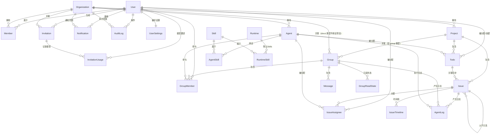

> 来源：`docs/plan/02-api.md` 第 810 行
> 位置：[总目录](../../README.md) -> [AnserFlow - API / Backend](../README.md) -> [二、核心数据模型](README.md) -> 2.1 ER 关系图
> 相邻：[上一篇](01-2.0-角色与权限管理（RBAC）.md) · [下一篇](03-2.2-关键表映射.md)
> 相关主题：[返回上级章节](README.md) · [返回文档入口](../README.md)

### 2.1 ER 关系图

