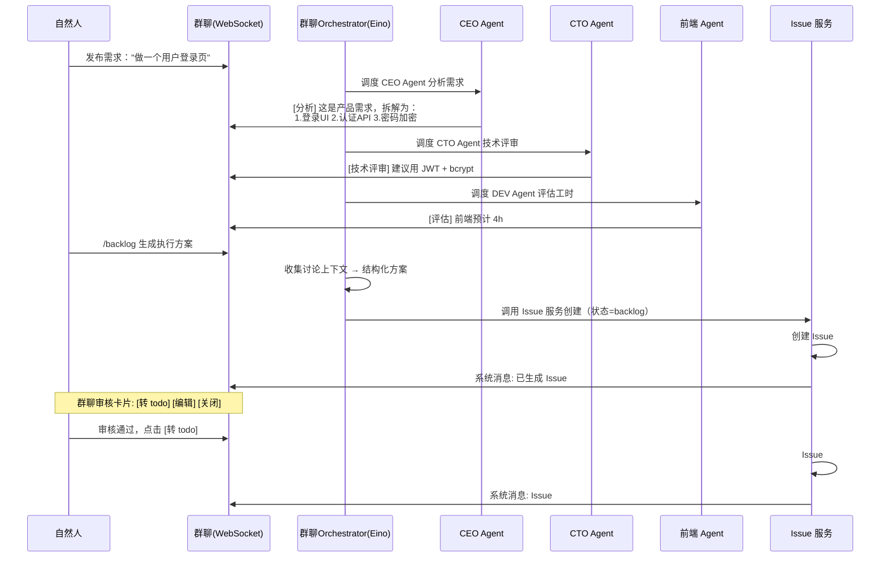

> 来源：`docs/plan/02-api.md` 第 1602 行
> 位置：[总目录](../../README.md) -> [AnserFlow - API / Backend](../README.md) -> [三、核心业务流程](README.md) -> 3.1 需求讨论 → /backlog 自动生成 Issue
> 相邻：[上一篇](README.md) · [下一篇](02-3.1.1-@Agent-任务布置（Agent-间协作）.md)
> 相关主题：[返回上级章节](README.md) · [返回文档入口](../README.md)

### 3.1 需求讨论 → /backlog 自动生成 Issue



**Tab 视图操作**（backlog → 确认/编辑 → 转为 todo）：

```
┌─ 项目 Issues ──────────────────────────────────────────────────────────────────┐
│  [ backlog 3 ]   todo 5    in_progress 2    in_review 1    done 12            │
├────────────────────────────────────────────────────────────────────────────────┤
│  ← 当前选中 backlog Tab，下面只展示 backlog 状态的 Issue                           │
│                                                                                │
│  ☐ Issue #1  实现用户登录页面                        P1  前端Agent  12:00     │
│  │ 描述: 使用 React Hook Form + Zod 实现...          [转为 todo] [编辑]       │
│  │ ── 时间线 ─────────────────────────────────────────────────────────────── │
│  │ 12:00  system   /backlog 创建此 Issue                                      │
│  │ 12:05  张三     编辑了标题 + 补充验收标准                                     │
│  │ 12:06  system   Eino 优化了描述（补充了错误处理边界）                          │
│  ├────────────────────────────────────────────────────────────────────────────┤
│  ☐ Issue #2  JWT 认证 API 实现                       P0  后端Agent  11:30     │
│  │ 描述: 实现 JWT 签发/验证，token 格式需要 @Issue #1 的登录接口对接...          │
│  │        [转为 todo] [编辑]                                                    │
│  ├────────────────────────────────────────────────────────────────────────────┤
│  ☐ Issue #3  密码加密存储                            P0  后端Agent  11:28     │
│  │ 描述: 使用 bcrypt 对密码加盐哈希...      [转为 todo] [编辑]                  │
│  └────────────────────────────────────────────────────────────────────────────┘
│                                                                                │
│  ☑ 已选 3 个  [一键转为 todo]  [批量编辑优先级]                                 │
└────────────────────────────────────────────────────────────────────────────────┘
```

点击 `todo 5` 标签后，列表切换为：

```
│  [ backlog 3 ]  [ todo 5 ]  in_progress 2    in_review 1    done 12          │
├────────────────────────────────────────────────────────────────────────────────┤
│  ← 当前选中 todo Tab，下面只展示 todo 状态的 Issue                                  │
│                                                                                │
│  Issue #4  API 接口文档编写                            P2  后端Agent  11:50    │
│  │ 状态: 排队中（第 2 位），预估等待 3 分钟                                       │
│  │ 时间线: 11:50 转为 todo · 11:50 加入调度队列                                   │
│  ├────────────────────────────────────────────────────────────────────────────┤
│  Issue #5  单元测试补充                              P2  前端Agent  11:40    │
│  │ 状态: 排队中（第 3 位）                                                       │
│  └────────────────────────────────────────────────────────────────────────────┘
```

> 每个 Tab 的数字表示该状态的 Issue 数量，实时更新。当前选中的 Tab 高亮显示。

**Tab 设计要点**：

| 特性 | 说明 |
|------|------|
| 顶部 Tab 栏 | 按状态分页，Tab 上显示各状态的 Issue 数量 |
| 当前 Tab | 默认进入 `backlog` Tab，展开第一个 Issue 的时间线 |
| Issue 行 | 可展开/折叠，展开后显示描述摘要 + 最近 3 条时间线 |
| 群聊审核 | backlog→todo 通过群聊审核卡片驱动（推荐），Tab 中 [转为 todo] 按钮为等效操作 |
| 批量操作 | 勾选多行 → 一键批量转 todo / 批量编辑优先级 |
| 状态流转 | todo Tab 中 Issue 会自动消失（调度器转为 in_progress 后移到对应 Tab） |

**Issue 编辑能力**（backlog / todo 阶段均可）：

| 操作 | 说明 |
|------|------|
| 编辑标题/描述 | 直接修改，写入 `issue_timeline`（event_type=system_note） |
| Eino 优化描述 | 调用 Eino 阅读描述 → 识别模糊点 → 补充技术细节、验收条件、边界情况 → 输出优化版 |
| 调整优先级 | P0-P4 下拉切换 |
| 修改负责人 | 重新分配 Agent 或自然人 |
| 删除 Issue | 仅 backlog 状态可删除 |
| 批量转 todo | Shift/Ctrl 多选 backlog Issue（来自多次 /backlog 调用）→ 一键全部转为 todo 列入执行队列 |
| @关联 Issue | 描述中通过 `@Issue #N` 引用其他 Issue，anserAgent 自动读取被引用 Issue 的内容注入到 anserAgent 执行提示词 |
