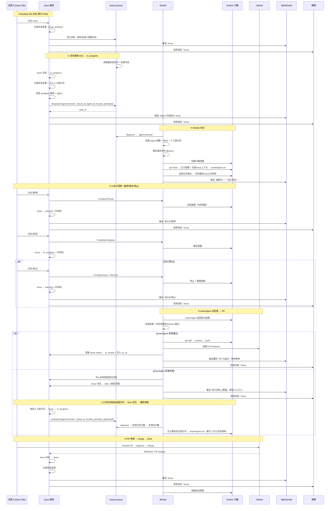

> 来源：`docs/plan/02-api.md` 第 1763 行
> 位置：[总目录](../../README.md) -> [AnserFlow - API / Backend](../README.md) -> [三、核心业务流程](README.md) -> 3.2 Agent 自动执行（backlog→todo→in_progress→in_review→done）
> 相邻：[上一篇](03-3.1.2-new-会话上下文切换.md) · 下一篇：无
> 相关主题：[返回上级章节](README.md) · [返回文档入口](../README.md)

### 3.2 Agent 自动执行（backlog→todo→in_progress→in_review→done）



**群聊审核驱动**：

所有需要人工决策的等待节点（backlog→todo 确认、PR 审核、失败后提示词补充），均通过**群聊消息**驱动，而非依赖人工主动检查页面：

```
┌─ 群聊 ──────────────────────────────────────────────────────────────┐
│ 12:00  system   已生成 Issue #1「实现用户登录页面」(backlog, P1)       │
│                [去审核] [转 todo] [编辑] [关闭]                      │
│ 12:03  张三     点击 [转 todo]                                       │
│ 12:03  system   Issue #1 已转入 todo Tab，排队等待 Agent 执行         │
│ ─────────────────────────────────────────────────────────────────── │
│ 12:30  system   Issue #1 PR 已提交 (in_review)                      │
│                PR: https://github.com/org/repo/pull/42              │
│                [去 Review] [查看变更]                                │
│ 12:35  张三     在 GitHub 完成 Review 并 Merge                       │
│ 12:35  system   Issue #1 已完成 (done) ✅                            │
│ ─────────────────────────────────────────────────────────────────── │
│ 13:00  system   Issue #2 执行失败: 测试 2/4 未通过                   │
│                [查看日志] [追加提示词]                                │
│ 13:02  张三     追加提示词: "login.test.tsx 的 mock 需要更新..."      │
│ 13:02  system   收到提示词，重新调度 Issue #2                         │
└─────────────────────────────────────────────────────────────────────┘
```

| 决策点 | 群聊动作 | 可选操作 |
|--------|---------|---------|
| backlog→todo | 系统发送 Issue 审核卡片到群聊 | [转 todo] / [编辑] / [关闭] |
| PR 待审核 | 系统发送 PR 链接卡片到群聊 | [去 Review] / [查看变更] |
| 执行失败 | 系统发送失败摘要到群聊 | [查看日志] / [追加提示词] / [停止] |
| PR 被拒 | 系统发送被拒原因到群聊 | [追加提示词] / [查看变更] / [放弃] |

**状态流转规则**：

| 状态 | 触发方式 | 下一状态 | 触发条件 |
|------|---------|---------|---------|
| `backlog` | `/backlog` 指令自动创建 | `todo` | **群聊审核通过（任一成员点击 [转 todo]）** |
| `todo` | 群聊审核通过后转为 todo | `in_progress` | 系统自动调度（按优先级+排队顺序） |
| `in_progress` | 系统自动 | `in_review` | anserAgent 检查通过 + PR 创建成功 |
| `in_progress` | 系统自动 | `paused` | 人工点击 [暂停] |
| `in_progress` | 系统自动 | `backlog` | 人工点击 [停止]（终止 anserAgent 进程，worktree 保留） |
| `paused` | 人工暂停 | `in_progress` | 人工点击 [恢复]（SIGCONT 恢复 anserAgent 进程） |
| `paused` | 人工暂停 | `backlog` | 人工点击 [停止]（终止 anserAgent 进程，worktree 保留） |
| `in_progress` | 系统自动 / 人工恢复 | `todo` | anserAgent 检查失败 → 保留 worktree → **群聊通知失败 → 等待成员追加提示词** |
| `in_review` | anserAgent 检查通过后 | `done` | GitHub Webhook 通知 PR 已 merge → git worktree remove → 群聊通知完成 |
| `in_review` | anserAgent 检查通过后 | `todo` | PR 被拒绝 → **群聊通知被拒原因 → 成员追加提示词** → Eino 优化 → 复用 worktree 重新执行 |

**人工提示词介入机制**：

Issue 的时间线面板允许自然人在任意阶段追加提示词，直接干预 anserAgent 的下一步执行：

```
┌─────────────────────────────────────────────────────────┐
│  Issue 时间线                                            │
│  ┌───────────────────────────────────────────────────┐  │
│  │ 12:00  system   状态变更: backlog → todo           │  │
│  │ 12:01  system   状态变更: todo → in_progress       │  │
│  │ 12:02  agent    开始编码: 正在读取 Issue 描述...    │  │
│  │ 12:05  agent    生成文件: src/login.tsx             │  │
│  │ 12:08  agent    运行测试: 2 passed, 1 failed       │  │
│  │ ─────────────────────────────────────────────      │  │
│  │ 12:09  张三     提示词: "login.tsx 的密码框需要     │  │
│  │                 autocomplete='new-password'"        │  │
│  │ 12:09  system   收到人工提示词，重新执行 anserflow    │  │
│  │ 12:12  agent    修复完成: lint + test 全部通过      │  │
│  └───────────────────────────────────────────────────┘  │
│                                                         │
│  ┌─ 追加提示词 ──────────────────────────────────────┐  │
│  │ [                    ]  [发送并重新执行]            │  │
│  └──────────────────────────────────────────────────┘  │
└─────────────────────────────────────────────────────────┘
```

**实现**：

- `POST /api/orgs/:org_id/projects/:project_id/issues/:issue_id/prompt` → 写入 `issue_timeline`（event_type=human_prompt）
- Issue 服务收到人工提示词后调用 `prompt_optimizer.Enhance()`（Eino 优化改写）
- 优化后的提示词写入时间线，触发 Issue 重新进入 in_progress
- Worker 检测到已有 worktree（`project_id → 容器 → /workspace/issue-{id}`），在 worktree 内继续执行
- anserflow 基于上次工作区状态 + 优化提示词继续编码
- Issue done 后清理 worktree（`git worktree remove`），容器常驻不销毁
- anserflow 重新执行时保留之前的 `issue_timeline` 日志记录

**GitHub Webhook 处理器**：

```go
// internal/handler/webhook.go
func (h *WebhookHandler) HandleGitHub(c *gin.Context) {
    event := c.GetHeader("X-GitHub-Event")
    if event != "pull_request" { return }

    var payload github.PullRequestEvent
    c.ShouldBindJSON(&payload)

    if payload.Action == "closed" && payload.PullRequest.Merged {
        // ① PR 已合并 → Issue done
        issue := h.issueRepo.FindByPRURL(payload.PullRequest.HTMLURL)
        h.issueRepo.UpdateStatus(issue.ID, "done")
        h.timelineRepo.Append(issue.ID, "system", "status_change",
            "in_review", "done", "PR merged by @"+payload.Sender.Login)
        // 销毁沙箱容器 + 清空 container_id
        if issue.SandboxContainerID != "" {
            h.sandbox.Destroy(ctx, issue.SandboxContainerID)
            h.issueRepo.ClearContainerID(issue.ID)
        }
        h.ws.SendToProject(issue.ProjectID, "Issue #%d 已完成", issue.ID)
        h.notification.NotifyIssueStatusChanged(ctx, issue, issue.CreatedBy)
        return
    }

    if payload.Action == "closed" && !payload.PullRequest.Merged {
        // ② PR 被拒绝（closed but not merged）→ Issue 回到 todo
        issue := h.issueRepo.FindByPRURL(payload.PullRequest.HTMLURL)
        rejectReason := fmt.Sprintf("PR #%d rejected by @%s",
            payload.PullRequest.Number, payload.Sender.Login)

        h.issueRepo.UpdateStatus(issue.ID, "todo")
        h.timelineRepo.Append(issue.ID, "system", "status_change",
            "in_review", "todo", rejectReason)

        // 保留沙箱容器（不销毁），后续人工提示词可复用上次工作区
        h.ws.SendToProject(issue.ProjectID,
            "Issue #%d PR 被拒绝，已退回 todo。可在时间线追加提示词后重新执行。", issue.ID)
        h.notification.NotifyIssueStatusChanged(ctx, issue, issue.CreatedBy)
        return
    }
}
```

> **PR 被拒绝的处理策略**：
> - 沙箱容器**保留不销毁**，后续人工追加提示词 → 重新入队时复用旧沙箱，基于上次工作区继续修改
> - 如果管理员判断 PR 方向完全错误需要重来，可通过 Issue 详情页 **[停止]** 按钮手动销毁沙箱后重新编辑
> - 状态流转：`in_review → todo`（而非 backlog），表示仍需处理但保留已有上下文

> GitHub Webhook 需在项目关联的 GitHub 仓库中配置 Payload URL: `https://<host>/api/webhook/github`，Events: `Pull requests`。

---
