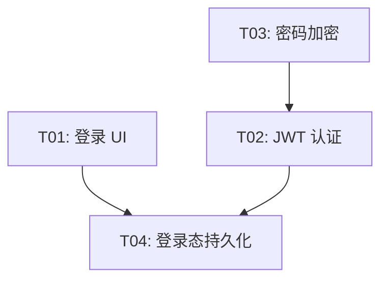

> 来源：`docs/plan/11-backlog.md` 第 101 行
> 位置：[总目录](../../README.md) -> [AnserFlow — 远期 Backlog（Phase 2+）](../README.md) -> [任务计划](README.md) -> 任务依赖图可视化
> 相邻：[上一篇](01-Agent-驱动的智能拆分.md) · [下一篇](03-Todo-↔-Issue-双向同步.md)
> 相关主题：[返回上级章节](README.md) · [返回文档入口](../README.md)

### 任务依赖图可视化

- **循环依赖检测**：自动告警并阻断
- **关键路径高亮**：决定总工期的最长依赖链
- **并行度分析**：最大可并行执行的任务数
- **看板联动**：拖动任务卡片自动更新依赖线

