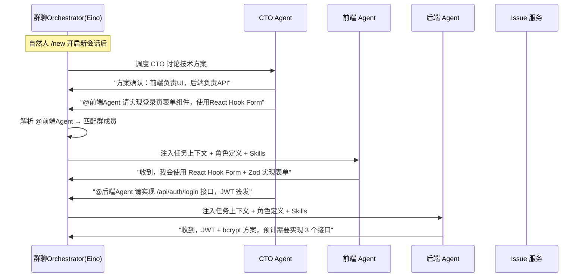

> ???`docs/plan/02-api.md` ? 1698 ?
> ???[???](../../README.md) -> [AnserFlow - API / Backend](../README.md) -> [三、核心业务流程](README.md) -> 3.1.1 @Agent 任务布置（Agent 间协作）
> ???[???](01-3.1-需求讨论-→-backlog-自动生成-Issue.md) ? [???](03-3.1.2-new-会话上下文切换.md)
> ?????[??????](README.md) ? [??????](../README.md)

### 3.1.1 @Agent 任务布置（Agent 间协作）

群内 Agent 可根据其他 Agent 的角色定义（`system_prompt` + 绑定 Skills），通过 `@AgentName` 语法向指定 Agent 布置任务。这是 Agent 间自主协作的核心机制：

**调度规则**：

| 规则 | 说明 |
|------|------|
| 角色感知 | `MentionResolver` 查询被 @ Agent 的角色定义，注入 System Prompt |
| Skill 继承 | 被 @ Agent 自动加载其绑定的 Skills（含 Runtime 默认 + Agent 独立绑定） |
| 上下文隔离 | 仅注入当前 `session_id` 内的消息历史，避免跨会话干扰 |
| 权限校验 | Casbin 校验发起 Agent 是否有权 @ 目标 Agent（同群成员即可） |
| 防循环 | 同一轮讨论中同一 Agent 最多被 @ 3 次，防止无限调度 |
