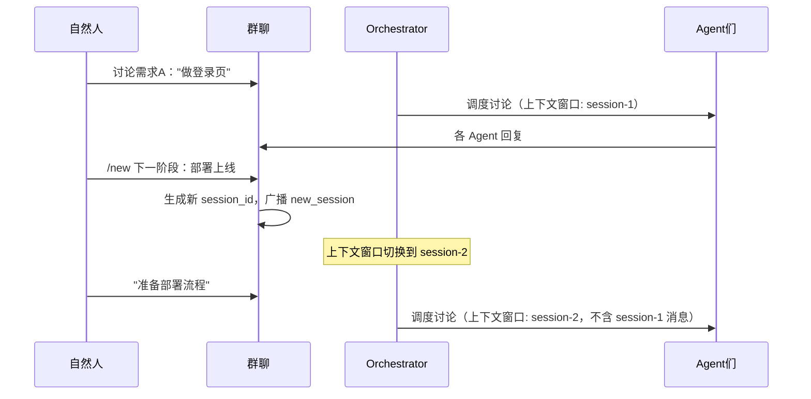

> ???`docs/plan/02-api.md` ? 1732 ?
> ???[???](../../README.md) -> [AnserFlow - API / Backend](../README.md) -> [三、核心业务流程](README.md) -> 3.1.2 `/new` 会话上下文切换
> ???[???](02-3.1.1-@Agent-任务布置（Agent-间协作）.md) ? [???](04-3.2-Agent-自动执行（backlog→todo→in_progress→in_review→done）.md)
> ?????[??????](README.md) ? [??????](../README.md)

### 3.1.2 `/new` 会话上下文切换

自然人发送 `/new` 开启新会话上下文。群聊消息历史仍在，但 Agent 的上下文窗口重置：

**设计要点**：

| 要点 | 说明 |
|------|------|
| 历史可见 | `/new` 不删除历史消息，客户端仍可向上滚动查看 |
| 上下文隔离 | Agent 的 LLM 调用仅注入当前 session 的消息，避免 Token 浪费和主题混淆 |
| 会话标题 | `/new` 后跟的文本（如 `/new 部署上线`）作为新会话标题，显示在消息列表的分割线处 |
| Agent 感知 | Agent 收到新会话的首条消息时，其 System Prompt 追加 "这是一个新讨论主题的开端" |
| `/backlog` 作用域 | `/backlog` 指令仅收集当前 session 内的讨论上下文 |
