> ???`docs/plan/07-architecture.md` ? 129 ?
> ???[???](../../README.md) -> [AnserFlow — 系统架构概述](../README.md) -> [二、技术栈总览](README.md) -> 系统功能模块总览
> ???[???](01-选型理由.md) ? [???](../05-参考代码映射.md)
> ?????[??????](README.md) ? [??????](../README.md)

### 系统功能模块总览

```mermaid
graph TD
    A["AnserFlow 平台"] --> B["用户与权限"]
    A --> C["Agent 管理"]
    A --> D["群聊协作"]
    A --> E["项目管理"]
    A --> F["Issue 系统"]
    A --> G["Agent 执行引擎"]
    A --> H["Skills 技能系统"]
    A --> R["运行时管理"]

    B --> B1["注册/登录(OAuth/GitHub)"]
    B --> B2["组织/团队管理"]
    B --> B3["角色权限(RBAC)"]
    B --> B4["邀请机制"]

    C --> C1["Agent 角色定义(自定义提示词)"]
    C --> C2["Agent System Prompt / 人设"]
    C --> C3["绑定运行时（anserAgent 默认）"]
    C --> C4["Agent 绑定运行时 + 配置覆盖"]
    C --> C5["全局开关 / 单独启停"]

    D --> D1["创建群组"]
    D --> D2["拉入 Agent + 自然人"]
    D --> D3["需求讨论(Agent自动参与)"]
    D --> D4["方案产出 → 自动建 Issue"]
    D --> D5["@Agent 任务布置(Agent间协作)"]
    D --> D6["/new 会话上下文切换"]

    E --> E1["创建项目"]
    E --> E2["关联 GitHub 仓库(HTTP/SSH)"]
    E --> E3["项目设置/成员"]

    F --> F1["Issue CRUD"]
    F --> F2["状态: Backlog→Todo→InProgress→InReview→Done"]
    F --> F3["优先级(P0-P4)"]
    F --> F4["子 Issue 层级"]
    F --> F5["分配给 Agent 或 自然人"]

    G --> G1["监听 todo→in_progress 自动入队"]
    G --> G2["Asynq 入队 → Worker 消费"]
    G --> G3["Docker 沙箱 + anserflow agent run"]
    G --> G4["anserflow 检查结果 → commit → PR"]
    G --> G5["监听人工提示词 → 重新执行"]

    H --> H1["Skill 定义(全局)"]
    H --> H2["Skill 绑定到 Agent"]
    H --> H3["Skill 启用/禁用(全局+单Agent)"]
    H --> H4["手动编写 + ZIP 导入"]
```

---
