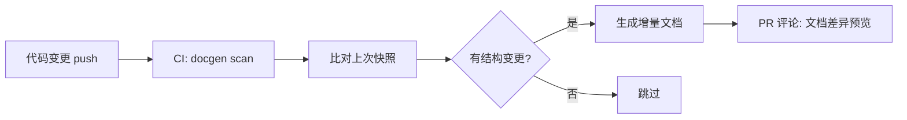

> ???`docs/plan/11-backlog.md` ? 9 ?
> ???[???](../../README.md) -> [AnserFlow — 远期 Backlog（Phase 2+）](../README.md) -> [文档生成](README.md) -> 代码 → 文档自动生成
> ???[???](README.md) ? [???](02-文档质量门禁.md)
> ?????[??????](README.md) ? [??????](../README.md)

### 代码 → 文档自动生成

| 源 | 产物 | 触发时机 |
|------|------|----------|
| GORM Model 结构体 | 数据字典 Markdown（字段/类型/约束/索引） | CI push main |
| Gin Handler + swag 注解 | OpenAPI 文档增强（含请求示例/错误码） | CI push main |
| TypeScript interface/type | API 契约文档 | CI push main |
| SQL Migration 文件 | 表结构变更日志 + 回滚说明 | `anserflow migrate` |
| Git commit log | CHANGELOG.md（按 Conventional Commits 分组） | CI tag `v*` |

```go
// internal/docgen/engine.go — 文档生成引擎
type DocGenerator interface {
    ScanSource(dir string) ([]SourceUnit, error)
    Generate(units []SourceUnit) (*Document, error)
    Diff(prev, current *Document) (*Changelog, error)
}
```


