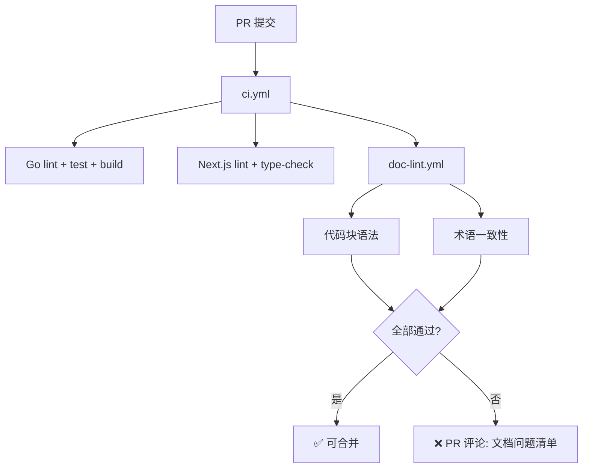

> ???`docs/plan/11-backlog.md` ? 38 ?
> ???[???](../../README.md) -> [AnserFlow — 远期 Backlog（Phase 2+）](../README.md) -> [文档生成](README.md) -> 文档质量门禁
> ???[???](01-代码-→-文档自动生成.md) ? [???](../02-任务计划/README.md)
> ?????[??????](README.md) ? [??????](../README.md)

### 文档质量门禁

```yaml
文档 CI 检查项:
  代码块语法校验:   ```go → go build   ```ts → tsc   ```sql → 语法解析
  Mermaid 语法:    mermaid-cli 渲染测试
  术语一致性:       关键词表校验（Issue / Agent / Skill 不混用别名）
  新鲜度评分:       对比关联代码变更频率，标记可能过时的文档章节
```


