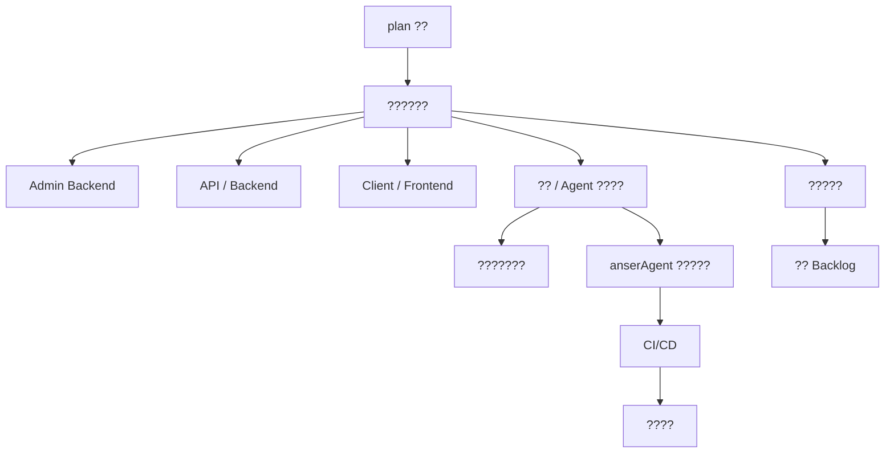

# AnserFlow Wiki

## ????

- [AnserFlow - Admin Backend](01-admin/README.md)
- [AnserFlow - API / Backend](02-api/README.md)
- [AnserFlow - Client / Frontend](03-client/README.md)
- [AnserFlow - 沙箱 / Agent 基础设施](04-sandbox/README.md)
- [AnserFlow - 沙箱执行运行时](04b-sandbox-runtime/README.md)
- [AnserFlow - anserAgent 智能体系统](06-agent/README.md)
- [AnserFlow — 系统架构概述](07-architecture/README.md)
- [AnserFlow - 部署指南](08-deployment/README.md)
- [AnserFlow — CI/CD](09-ci-cd/README.md)
- [AnserFlow — 开发路线图](10-roadmap/README.md)
- [AnserFlow — 远期 Backlog（Phase 2+）](11-backlog/README.md)
- [AnserFlow 文档索引](plan-index/README.md)

## ??????

- ?????[????](07-architecture/README.md) -> [???????](01-admin/README.md) -> [API ?????](02-api/README.md) -> [?????](03-client/README.md)
- ?????[??????](04-sandbox/README.md) -> [???????](04b-sandbox-runtime/README.md) -> [?????](06-agent/README.md) -> [CI/CD](09-ci-cd/README.md) -> [????](08-deployment/README.md)
- ?????[????](plan-index/README.md) -> [?????](10-roadmap/README.md) -> [?? Backlog](11-backlog/README.md)

## ????

## ?????

- [AnserFlow - Admin Backend](01-admin/README.md)
- AnserFlow - Admin Backend / [完整配置文件 (config.yaml)](01-admin/01-完整配置文件-config.yaml/README.md)
- AnserFlow - Admin Backend / 完整配置文件 (config.yaml) / [配置归属速查](01-admin/01-完整配置文件-config.yaml/01-配置归属速查.md)
- AnserFlow - Admin Backend / 完整配置文件 (config.yaml) / [配置热更新机制](01-admin/01-完整配置文件-config.yaml/02-配置热更新机制.md)
- AnserFlow - Admin Backend / 完整配置文件 (config.yaml) / [后台管理页面结构](01-admin/01-完整配置文件-config.yaml/03-后台管理页面结构.md)
- AnserFlow - Admin Backend / [四、构建与部署](01-admin/02-四、构建与部署/README.md)
- AnserFlow - Admin Backend / 四、构建与部署 / [4.1 单一可执行文件](01-admin/02-四、构建与部署/01-4.1-单一可执行文件.md)
- AnserFlow - Admin Backend / 四、构建与部署 / [4.2 Next.js SPA 模式](01-admin/02-四、构建与部署/02-4.2-Next.js-SPA-模式.md)
- [AnserFlow - API / Backend](02-api/README.md)
- AnserFlow - API / Backend / [框架补充说明](02-api/01-框架补充说明.md)
- AnserFlow - API / Backend / [一、分布式架构设计](02-api/02-一、分布式架构设计/README.md)
- AnserFlow - API / Backend / 一、分布式架构设计 / [1.1 WebSocket 分布式方案](02-api/02-一、分布式架构设计/01-1.1-WebSocket-分布式方案.md)
- AnserFlow - API / Backend / 一、分布式架构设计 / [1.2 任务队列方案](02-api/02-一、分布式架构设计/02-1.2-任务队列方案.md)
- AnserFlow - API / Backend / 一、分布式架构设计 / [1.3 整体分布式拓扑](02-api/02-一、分布式架构设计/03-1.3-整体分布式拓扑.md)
- AnserFlow - API / Backend / [二、核心数据模型](02-api/03-二、核心数据模型/README.md)
- AnserFlow - API / Backend / 二、核心数据模型 / [2.0 角色与权限管理（RBAC）](02-api/03-二、核心数据模型/01-2.0-角色与权限管理（RBAC）.md)
- AnserFlow - API / Backend / 二、核心数据模型 / [2.1 ER 关系图](02-api/03-二、核心数据模型/02-2.1-ER-关系图.md)
- AnserFlow - API / Backend / 二、核心数据模型 / [2.2 关键表映射](02-api/03-二、核心数据模型/03-2.2-关键表映射.md)
- AnserFlow - API / Backend / 二、核心数据模型 / [2.3 邀请机制说明](02-api/03-二、核心数据模型/04-2.3-邀请机制说明.md)
- AnserFlow - API / Backend / 二、核心数据模型 / [2.4 邮件服务](02-api/03-二、核心数据模型/05-2.4-邮件服务.md)
- AnserFlow - API / Backend / 二、核心数据模型 / [2.5 API 路由总览](02-api/03-二、核心数据模型/06-2.5-API-路由总览.md)
- AnserFlow - API / Backend / 二、核心数据模型 / [2.5.1 双人聊 API 详细说明](02-api/03-二、核心数据模型/07-2.5.1-双人聊-API-详细说明.md)
- AnserFlow - API / Backend / 二、核心数据模型 / [2.5.2 Dashboard 聚合 API](02-api/03-二、核心数据模型/08-2.5.2-Dashboard-聚合-API.md)
- AnserFlow - API / Backend / 二、核心数据模型 / [2.6 通知生成与分发](02-api/03-二、核心数据模型/09-2.6-通知生成与分发.md)
- AnserFlow - API / Backend / [三、核心业务流程](02-api/04-三、核心业务流程/README.md)
- AnserFlow - API / Backend / 三、核心业务流程 / [3.1 需求讨论 → /backlog 自动生成 Issue](02-api/04-三、核心业务流程/01-3.1-需求讨论-→-backlog-自动生成-Issue.md)
- AnserFlow - API / Backend / 三、核心业务流程 / [3.1.1 @Agent 任务布置（Agent 间协作）](02-api/04-三、核心业务流程/02-3.1.1-@Agent-任务布置（Agent-间协作）.md)
- AnserFlow - API / Backend / 三、核心业务流程 / [3.1.2 `/new` 会话上下文切换](02-api/04-三、核心业务流程/03-3.1.2-new-会话上下文切换.md)
- AnserFlow - API / Backend / 三、核心业务流程 / [3.2 Agent 自动执行（backlog→todo→in_progress→in_review→done）](02-api/04-三、核心业务流程/04-3.2-Agent-自动执行（backlog→todo→in_progress→in_review→done）.md)
- [AnserFlow - Client / Frontend](03-client/README.md)
- AnserFlow - Client / Frontend / [前端框架补充说明](03-client/01-前端框架补充说明.md)
- AnserFlow - Client / Frontend / [国际化（i18n）](03-client/02-国际化（i18n）.md)
- AnserFlow - Client / Frontend / [客户端（Web SPA）](03-client/03-客户端（Web-SPA）.md)
- [AnserFlow - 沙箱 / Agent 基础设施](04-sandbox/README.md)
- AnserFlow - 沙箱 / Agent 基础设施 / [一、AI Agent 框架：Eino + 自研封装](04-sandbox/01-一、AI-Agent-框架：Eino-+-自研封装/README.md)
- AnserFlow - 沙箱 / Agent 基础设施 / 一、AI Agent 框架：Eino + 自研封装 / [架构分层](04-sandbox/01-一、AI-Agent-框架：Eino-+-自研封装/01-架构分层.md)
- AnserFlow - 沙箱 / Agent 基础设施 / 一、AI Agent 框架：Eino + 自研封装 / [Eino 初始化与配置](04-sandbox/01-一、AI-Agent-框架：Eino-+-自研封装/02-Eino-初始化与配置.md)
- AnserFlow - 沙箱 / Agent 基础设施 / 一、AI Agent 框架：Eino + 自研封装 / [Agent 运行时配置](04-sandbox/01-一、AI-Agent-框架：Eino-+-自研封装/03-Agent-运行时配置.md)
- AnserFlow - 沙箱 / Agent 基础设施 / 一、AI Agent 框架：Eino + 自研封装 / [ChatModel 调用示例](04-sandbox/01-一、AI-Agent-框架：Eino-+-自研封装/04-ChatModel-调用示例.md)
- AnserFlow - 沙箱 / Agent 基础设施 / 一、AI Agent 框架：Eino + 自研封装 / [Tool / Skill 抽象](04-sandbox/01-一、AI-Agent-框架：Eino-+-自研封装/05-Tool-Skill-抽象.md)
- AnserFlow - 沙箱 / Agent 基础设施 / 一、AI Agent 框架：Eino + 自研封装 / [Skill 两层继承（沙箱执行时）](04-sandbox/01-一、AI-Agent-框架：Eino-+-自研封装/06-Skill-两层继承（沙箱执行时）.md)
- AnserFlow - 沙箱 / Agent 基础设施 / 一、AI Agent 框架：Eino + 自研封装 / [提示词管理器（PromptManager）](04-sandbox/01-一、AI-Agent-框架：Eino-+-自研封装/07-提示词管理器（PromptManager）.md)
- AnserFlow - 沙箱 / Agent 基础设施 / [触发条件](04-sandbox/02-触发条件.md)
- AnserFlow - 沙箱 / Agent 基础设施 / [创建规则](04-sandbox/03-创建规则/README.md)
- AnserFlow - 沙箱 / Agent 基础设施 / 创建规则 / [2.3 Go Docker SDK](04-sandbox/03-创建规则/01-2.3-Go-Docker-SDK.md)
- AnserFlow - 沙箱 / Agent 基础设施 / 创建规则 / [2.3.1 运行时数据目录 — 三层架构](04-sandbox/03-创建规则/02-2.3.1-运行时数据目录-—-三层架构.md)
- AnserFlow - 沙箱 / Agent 基础设施 / 创建规则 / [2.4 GitHub SDK 集成](04-sandbox/03-创建规则/03-2.4-GitHub-SDK-集成.md)
- AnserFlow - 沙箱 / Agent 基础设施 / [三、Skills 技能系统](04-sandbox/04-三、Skills-技能系统/README.md)
- AnserFlow - 沙箱 / Agent 基础设施 / 三、Skills 技能系统 / [3.1 两种导入方式](04-sandbox/04-三、Skills-技能系统/01-3.1-两种导入方式.md)
- AnserFlow - 沙箱 / Agent 基础设施 / 三、Skills 技能系统 / [3.2 ZIP 包格式](04-sandbox/04-三、Skills-技能系统/02-3.2-ZIP-包格式.md)
- AnserFlow - 沙箱 / Agent 基础设施 / 三、Skills 技能系统 / [3.3 ZIP 导入完整流程](04-sandbox/04-三、Skills-技能系统/03-3.3-ZIP-导入完整流程.md)
- AnserFlow - 沙箱 / Agent 基础设施 / 三、Skills 技能系统 / [3.4 启用控制](04-sandbox/04-三、Skills-技能系统/04-3.4-启用控制.md)
- [AnserFlow - 沙箱执行运行时](04b-sandbox-runtime/README.md)
- AnserFlow - 沙箱执行运行时 / [一、运行时适配器架构](04b-sandbox-runtime/01-一、运行时适配器架构/README.md)
- AnserFlow - 沙箱执行运行时 / 一、运行时适配器架构 / [设计原则](04b-sandbox-runtime/01-一、运行时适配器架构/01-设计原则.md)
- AnserFlow - 沙箱执行运行时 / 一、运行时适配器架构 / [接口定义](04b-sandbox-runtime/01-一、运行时适配器架构/02-接口定义.md)
- AnserFlow - 沙箱执行运行时 / 一、运行时适配器架构 / [当前实现：anserAgent](04b-sandbox-runtime/01-一、运行时适配器架构/03-当前实现：anserAgent.md)
- AnserFlow - 沙箱执行运行时 / 一、运行时适配器架构 / [RuntimeManager — 简化管理器](04b-sandbox-runtime/01-一、运行时适配器架构/04-RuntimeManager-—-简化管理器.md)
- AnserFlow - 沙箱执行运行时 / 一、运行时适配器架构 / [Worker 调用示例（运行时无关）](04b-sandbox-runtime/01-一、运行时适配器架构/05-Worker-调用示例（运行时无关）.md)
- AnserFlow - 沙箱执行运行时 / [二、沙箱镜像与执行细节](04b-sandbox-runtime/02-二、沙箱镜像与执行细节/README.md)
- AnserFlow - 沙箱执行运行时 / 二、沙箱镜像与执行细节 / [Dockerfile](04b-sandbox-runtime/02-二、沙箱镜像与执行细节/01-Dockerfile.md)
- AnserFlow - 沙箱执行运行时 / 二、沙箱镜像与执行细节 / [entrypoint.sh](04b-sandbox-runtime/02-二、沙箱镜像与执行细节/02-entrypoint.sh.md)
- AnserFlow - 沙箱执行运行时 / 二、沙箱镜像与执行细节 / [Go Docker SDK](04b-sandbox-runtime/02-二、沙箱镜像与执行细节/03-Go-Docker-SDK.md)
- AnserFlow - 沙箱执行运行时 / 二、沙箱镜像与执行细节 / [运行时数据目录](04b-sandbox-runtime/02-二、沙箱镜像与执行细节/04-运行时数据目录.md)
- AnserFlow - 沙箱执行运行时 / [三、扩展新运行时指南](04b-sandbox-runtime/03-三、扩展新运行时指南/README.md)
- AnserFlow - 沙箱执行运行时 / 三、扩展新运行时指南 / [步骤 1: 实现接口](04b-sandbox-runtime/03-三、扩展新运行时指南/01-步骤-1-实现接口.md)
- AnserFlow - 沙箱执行运行时 / 三、扩展新运行时指南 / [步骤 2: 替换初始化](04b-sandbox-runtime/03-三、扩展新运行时指南/02-步骤-2-替换初始化.md)
- AnserFlow - 沙箱执行运行时 / 三、扩展新运行时指南 / [步骤 3: 更新 Dockerfile](04b-sandbox-runtime/03-三、扩展新运行时指南/03-步骤-3-更新-Dockerfile.md)
- [AnserFlow - anserAgent 智能体系统](06-agent/README.md)
- AnserFlow - anserAgent 智能体系统 / [一、系统定位](06-agent/01-一、系统定位.md)
- AnserFlow - anserAgent 智能体系统 / [二、设计基础 — Agent 统一接口](06-agent/02-二、设计基础-—-Agent-统一接口.md)
- AnserFlow - anserAgent 智能体系统 / [三、目录结构](06-agent/03-三、目录结构.md)
- AnserFlow - anserAgent 智能体系统 / [四、Workflow Agents — 确定性编排](06-agent/04-四、Workflow-Agents-—-确定性编排/README.md)
- AnserFlow - anserAgent 智能体系统 / 四、Workflow Agents — 确定性编排 / [4.1 SequentialAgent — 顺序执行](06-agent/04-四、Workflow-Agents-—-确定性编排/01-4.1-SequentialAgent-—-顺序执行.md)
- AnserFlow - anserAgent 智能体系统 / 四、Workflow Agents — 确定性编排 / [4.2 ParallelAgent — 并发执行](06-agent/04-四、Workflow-Agents-—-确定性编排/02-4.2-ParallelAgent-—-并发执行.md)
- AnserFlow - anserAgent 智能体系统 / 四、Workflow Agents — 确定性编排 / [4.3 LoopAgent — 循环执行](06-agent/04-四、Workflow-Agents-—-确定性编排/03-4.3-LoopAgent-—-循环执行.md)
- AnserFlow - anserAgent 智能体系统 / 四、Workflow Agents — 确定性编排 / [4.4 组合示例：沙箱编码流水线](06-agent/04-四、Workflow-Agents-—-确定性编排/04-4.4-组合示例：沙箱编码流水线.md)
- AnserFlow - anserAgent 智能体系统 / [五、中断与恢复](06-agent/05-五、中断与恢复/README.md)
- AnserFlow - anserAgent 智能体系统 / 五、中断与恢复 / [5.1 核心概念](06-agent/05-五、中断与恢复/01-5.1-核心概念.md)
- AnserFlow - anserAgent 智能体系统 / 五、中断与恢复 / [5.2 CheckPointStore 接口](06-agent/05-五、中断与恢复/02-5.2-CheckPointStore-接口.md)
- AnserFlow - anserAgent 智能体系统 / 五、中断与恢复 / [5.3 典型流程](06-agent/05-五、中断与恢复/03-5.3-典型流程.md)
- AnserFlow - anserAgent 智能体系统 / [六、Human-in-the-Loop](06-agent/06-六、Human-in-the-Loop/README.md)
- AnserFlow - anserAgent 智能体系统 / 六、Human-in-the-Loop / [6.1 模式总览](06-agent/06-六、Human-in-the-Loop/01-6.1-模式总览.md)
- AnserFlow - anserAgent 智能体系统 / 六、Human-in-the-Loop / [6.2 [Phase 2] 群聊审批模式（合并审批）](06-agent/06-六、Human-in-the-Loop/02-6.2-Phase-2-群聊审批模式（合并审批）.md)
- AnserFlow - anserAgent 智能体系统 / [行为约束](06-agent/07-行为约束.md)
- AnserFlow - anserAgent 智能体系统 / [沟通风格](06-agent/08-沟通风格.md)
- AnserFlow - anserAgent 智能体系统 / [安全边界](06-agent/09-安全边界.md)
- AnserFlow - anserAgent 智能体系统 / [快速路由](06-agent/10-快速路由.md)
- AnserFlow - anserAgent 智能体系统 / [检索策略](06-agent/11-检索策略.md)
- AnserFlow - anserAgent 智能体系统 / [后端](06-agent/12-后端.md)
- AnserFlow - anserAgent 智能体系统 / [前端](06-agent/13-前端.md)
- AnserFlow - anserAgent 智能体系统 / [沙箱](06-agent/14-沙箱.md)
- AnserFlow - anserAgent 智能体系统 / [触发条件](06-agent/15-触发条件.md)
- AnserFlow - anserAgent 智能体系统 / [标准流程](06-agent/16-标准流程.md)
- AnserFlow - anserAgent 智能体系统 / [已知陷阱](06-agent/17-已知陷阱.md)
- AnserFlow - anserAgent 智能体系统 / [改进历史](06-agent/18-改进历史.md)
- AnserFlow - anserAgent 智能体系统 / [任务摘要](06-agent/19-任务摘要.md)
- AnserFlow - anserAgent 智能体系统 / [关键决策](06-agent/20-关键决策.md)
- AnserFlow - anserAgent 智能体系统 / [踩过的坑](06-agent/21-踩过的坑.md)
- AnserFlow - anserAgent 智能体系统 / [经验贡献](06-agent/22-经验贡献.md)
- [AnserFlow — 系统架构概述](07-architecture/README.md)
- AnserFlow — 系统架构概述 / [一、系统愿景](07-architecture/01-一、系统愿景.md)
- AnserFlow — 系统架构概述 / [当前阶段闭环约束](07-architecture/02-当前阶段闭环约束.md)
- AnserFlow — 系统架构概述 / [目标架构与参考骨架差异清单](07-architecture/03-目标架构与参考骨架差异清单/README.md)
- AnserFlow — 系统架构概述 / 目标架构与参考骨架差异清单 / [建议保留的模块](07-architecture/03-目标架构与参考骨架差异清单/01-建议保留的模块.md)
- AnserFlow — 系统架构概述 / 目标架构与参考骨架差异清单 / [建议废弃或不要直接沿用的部分](07-architecture/03-目标架构与参考骨架差异清单/02-建议废弃或不要直接沿用的部分.md)
- AnserFlow — 系统架构概述 / 目标架构与参考骨架差异清单 / [建议做映射迁移的模块](07-architecture/03-目标架构与参考骨架差异清单/03-建议做映射迁移的模块.md)
- AnserFlow — 系统架构概述 / 目标架构与参考骨架差异清单 / [结论](07-architecture/03-目标架构与参考骨架差异清单/04-结论.md)
- AnserFlow — 系统架构概述 / [二、技术栈总览](07-architecture/04-二、技术栈总览/README.md)
- AnserFlow — 系统架构概述 / 二、技术栈总览 / [选型理由](07-architecture/04-二、技术栈总览/01-选型理由.md)
- AnserFlow — 系统架构概述 / 二、技术栈总览 / [系统功能模块总览](07-architecture/04-二、技术栈总览/02-系统功能模块总览.md)
- AnserFlow — 系统架构概述 / [参考代码映射](07-architecture/05-参考代码映射.md)
- AnserFlow — 系统架构概述 / [关键风险](07-architecture/06-关键风险/README.md)
- AnserFlow — 系统架构概述 / 关键风险 / [简化策略](07-architecture/06-关键风险/01-简化策略.md)
- [AnserFlow - 部署指南](08-deployment/README.md)
- AnserFlow - 部署指南 / [架构总览](08-deployment/01-架构总览.md)
- AnserFlow - 部署指南 / [前置依赖](08-deployment/02-前置依赖.md)
- AnserFlow - 部署指南 / [部署模式](08-deployment/03-部署模式/README.md)
- AnserFlow - 部署指南 / 部署模式 / [模式 A：单机一体化（推荐起步）](08-deployment/03-部署模式/01-模式-A：单机一体化（推荐起步）.md)
- AnserFlow - 部署指南 / 部署模式 / [模式 B：分布式部署](08-deployment/03-部署模式/02-模式-B：分布式部署.md)
- AnserFlow - 部署指南 / [部署检查清单](08-deployment/04-部署检查清单.md)
- AnserFlow - 部署指南 / [服务器关键目录结构](08-deployment/05-服务器关键目录结构.md)
- AnserFlow - 部署指南 / [注意事项](08-deployment/06-注意事项.md)
- [AnserFlow — CI/CD](09-ci-cd/README.md)
- AnserFlow — CI/CD / [GitHub Flow 分支策略](09-ci-cd/01-GitHub-Flow-分支策略.md)
- AnserFlow — CI/CD / [GitHub Actions 工作流总览](09-ci-cd/02-GitHub-Actions-工作流总览.md)
- AnserFlow — CI/CD / [ci.yml — Pull Request 检查](09-ci-cd/03-ci.yml-—-Pull-Request-检查.md)
- AnserFlow — CI/CD / [sandbox-image.yml — Docker 沙箱镜像](09-ci-cd/04-sandbox-image.yml-—-Docker-沙箱镜像.md)
- AnserFlow — CI/CD / [go-release.yml — Go 后端发布](09-ci-cd/05-go-release.yml-—-Go-后端发布.md)
- AnserFlow — CI/CD / [GitHub Secrets 清单](09-ci-cd/06-GitHub-Secrets-清单.md)
- AnserFlow — CI/CD / [分支保护规则](09-ci-cd/07-分支保护规则.md)
- [AnserFlow — 开发路线图](10-roadmap/README.md)
- AnserFlow — 开发路线图 / [L1 — 基础设施（1-2 周）](10-roadmap/01-L1-—-基础设施（1-2-周）.md)
- AnserFlow — 开发路线图 / [L2 — 核心业务（3-4 周）](10-roadmap/02-L2-—-核心业务（3-4-周）.md)
- AnserFlow — 开发路线图 / [L3 — 协作与执行（5-7 周）](10-roadmap/03-L3-—-协作与执行（5-7-周）.md)
- AnserFlow — 开发路线图 / [L4 — 客户端与交付（8-10 周）](10-roadmap/04-L4-—-客户端与交付（8-10-周）.md)
- AnserFlow — 开发路线图 / [测试策略](10-roadmap/05-测试策略.md)
- AnserFlow — 开发路线图 / [数据库迁移策略](10-roadmap/06-数据库迁移策略/README.md)
- AnserFlow — 开发路线图 / 数据库迁移策略 / [数据库`restore` 子命令](10-roadmap/06-数据库迁移策略/01-数据库restore-子命令.md)
- AnserFlow — 开发路线图 / [种子数据](10-roadmap/07-种子数据.md)
- [AnserFlow — 远期 Backlog（Phase 2+）](11-backlog/README.md)
- AnserFlow — 远期 Backlog（Phase 2+） / [文档生成](11-backlog/01-文档生成/README.md)
- AnserFlow — 远期 Backlog（Phase 2+） / 文档生成 / [代码 → 文档自动生成](11-backlog/01-文档生成/01-代码-→-文档自动生成.md)
- AnserFlow — 远期 Backlog（Phase 2+） / 文档生成 / [文档质量门禁](11-backlog/01-文档生成/02-文档质量门禁.md)
- AnserFlow — 远期 Backlog（Phase 2+） / [任务计划](11-backlog/02-任务计划/README.md)
- AnserFlow — 远期 Backlog（Phase 2+） / 任务计划 / [Agent 驱动的智能拆分](11-backlog/02-任务计划/01-Agent-驱动的智能拆分.md)
- AnserFlow — 远期 Backlog（Phase 2+） / 任务计划 / [任务依赖图可视化](11-backlog/02-任务计划/02-任务依赖图可视化.md)
- AnserFlow — 远期 Backlog（Phase 2+） / 任务计划 / [Todo ↔ Issue 双向同步](11-backlog/02-任务计划/03-Todo-↔-Issue-双向同步.md)
- AnserFlow — 远期 Backlog（Phase 2+） / 任务计划 / [执行策略引擎](11-backlog/02-任务计划/04-执行策略引擎.md)
- AnserFlow — 远期 Backlog（Phase 2+） / 任务计划 / [多维度任务视图](11-backlog/02-任务计划/05-多维度任务视图.md)
- AnserFlow — 远期 Backlog（Phase 2+） / [工程基础设施（Phase 2）](11-backlog/03-工程基础设施（Phase-2）/README.md)
- AnserFlow — 远期 Backlog（Phase 2+） / 工程基础设施（Phase 2） / [Pact 合约测试](11-backlog/03-工程基础设施（Phase-2）/01-Pact-合约测试.md)
- AnserFlow — 远期 Backlog（Phase 2+） / 工程基础设施（Phase 2） / [golang-migrate 迁移工具](11-backlog/03-工程基础设施（Phase-2）/02-golang-migrate-迁移工具.md)
- AnserFlow — 远期 Backlog（Phase 2+） / 工程基础设施（Phase 2） / [Crowdin / Lokalise 翻译管理](11-backlog/03-工程基础设施（Phase-2）/03-Crowdin-Lokalise-翻译管理.md)
- AnserFlow — 远期 Backlog（Phase 2+） / 工程基础设施（Phase 2） / [RTK 命令输出压缩](11-backlog/03-工程基础设施（Phase-2）/04-RTK-命令输出压缩.md)
- AnserFlow — 远期 Backlog（Phase 2+） / [可参考项目](11-backlog/04-可参考项目.md)
- [AnserFlow 文档索引](plan-index/README.md)
- AnserFlow 文档索引 / [文档关系图](plan-index/01-文档关系图.md)
- AnserFlow 文档索引 / [阅读顺序建议](plan-index/02-阅读顺序建议.md)
- AnserFlow 文档索引 / [引用说明](plan-index/03-引用说明.md)

## ????

- ??????`docs/`
- ????? `docs/` ? Markdown ??
- ??? DDL ?????`docs/ddl.sql`
